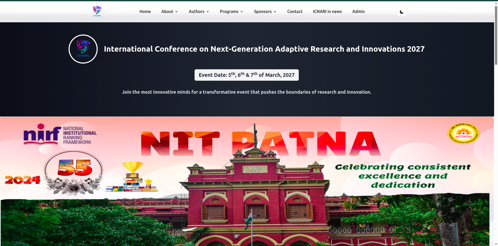
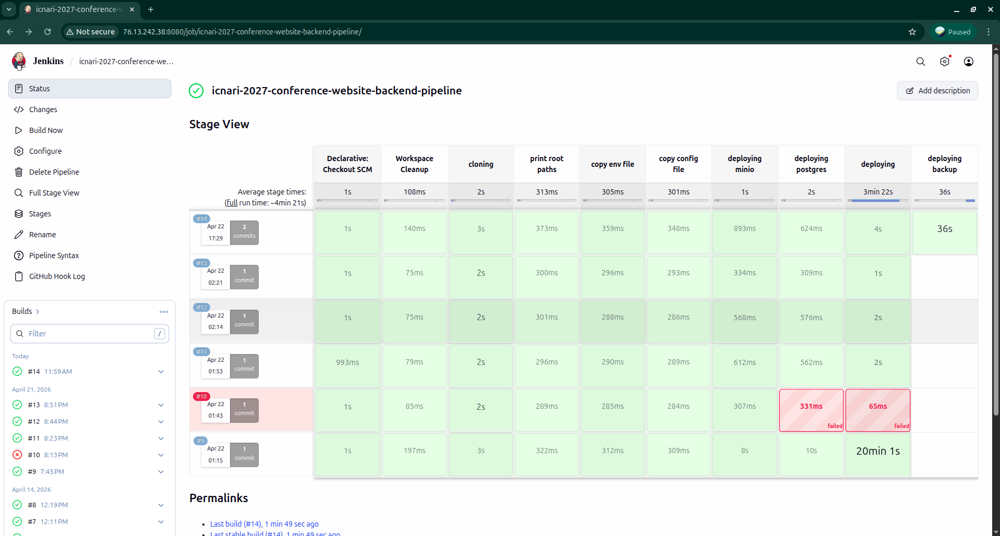

# 🎓 ICNARI 2027 — Conference Website (NIT Patna)

Conference website + admin dashboard for **ICNARI 2027**.



## ✨ What’s in this repo

- 🖥️ **Frontend**: React + Vite + Tailwind (public site + admin dashboard)
- ⚙️ **Backend**: C++ API built with Drogon
- 🗄️ **Data**: PostgreSQL
- 🪣 **Storage**: MinIO (S3-compatible)
- 🧰 **Ops**: Docker Compose, Nginx reverse-proxy configs, Jenkins pipeline, backup container

## 🗂️ Repository structure

- `frontend/` — Vite + React app
- `backend/` — Drogon API, OpenAPI spec, SQL init scripts, local/prod Docker Compose
- `backup/` — containerized scheduled backups (Postgres dump + MinIO mirroring)
- `assets/` — README images
- `*.nginx.conf` — Nginx reverse proxy configs for API, DB, and MinIO
- `Jenkinsfile` — CI/CD pipeline used for deployment

## 🧑‍💻 Local development

### 1) 🧱 Start PostgreSQL + MinIO

```bash
cd backend
docker compose up -d
```

Services (from `backend/docker-compose.yml`):

- 🐘 PostgreSQL: `localhost:5432`
- 🧊 MinIO S3 API: `http://localhost:9000`
- 🖱️ MinIO Console: `http://localhost:9001`
Database initialization:

- 🧾 `backend/sql/` is mounted into Postgres init (`/docker-entrypoint-initdb.d`).

### 2) 🔐 Configure backend env

```bash
cd backend
cp .env.example .env
```

Common variables (see `backend/.env.example`):

- `PORT` (default `3000`)
- `JWT_SECRET`
- `S3_ENDPOINT`, `S3_REGION`, `S3_ACCESS_KEY`, `S3_SECRET_KEY`, `S3_BUCKET`, `S3_USE_SSL`

DB connection settings live in `backend/config/config.json`.

### 3) 🧱 Build + run the backend (native)

Prerequisites:

- C++ toolchain (gcc/clang)
- CMake (>= 3.15)
- Conan 2.x

Build:

```bash
cd backend
conan profile detect --force
conan install . \
	--output-folder=build \
	--build=missing \
	-c tools.system.package_manager:mode=install \
	-c tools.system.package_manager:sudo=True

cmake --preset conan-release
cmake --build --preset conan-release
```

Run (important: run from inside `backend/` so `./config/config.json` resolves):

```bash
cd backend
./build/ICNARI_Conference_Backend
```

Optional: 👤 create an admin user (after building):

```bash
cd backend
./build/createAdmin ./config/config.json
```

### 4) 🧩 Configure + run the frontend

Prerequisites:

- Node.js (LTS recommended)
- pnpm (recommended; repo includes `pnpm-lock.yaml`)

Configure API base URL:

```bash
cd frontend
cp .env.example .env
```

Default:

- `VITE_API_URL=http://localhost:3000`

Install + run:

```bash
cd frontend
pnpm install
pnpm dev
```

Vite typically serves at `http://localhost:5173`.

## 📡 API

- 📄 OpenAPI spec: `backend/routes/openapi.yaml`
- ❤️ Health: `GET /health`
- 🧭 Versioned base path: `/api/v1/...`

OpenAPI tags include Auth, Users, Notifications, Gallery, Speaker, Committee, and Contact.

## 🚀 Production deployment (Docker + Nginx + Jenkins)

### 🐳 Backend container

The backend container is built/run via:

```bash
cd backend
docker compose -f docker-compose.prod.yml up -d --build
```

Important port mapping:

- 🔌 `backend/docker-compose.prod.yml` maps host `4000` to container `3000` (`4000:3000`).
- 🔁 The Nginx API config (`icnari27.nginx.conf`) proxies to `127.0.0.1:4000`.

### 🧱 MinIO + Postgres containers

Separate prod compose files exist for infrastructure:

- `backend/docker-compose.prod.s3.yml`
- `backend/docker-compose.prod.db.yml`

### 🌐 Reverse proxy configs

Nginx configs in the repo root proxy requests to local ports:

- `icnari27.nginx.conf` → API (`127.0.0.1:4000`)
- `s3.nginx.conf` → MinIO S3 (`127.0.0.1:9000`)
- `s3.ui.nginx.conf` → MinIO Console (`127.0.0.1:9001`)
- `postgres.nginx.conf` → Postgres (`127.0.0.1:5432`)

### 🧪 Jenkins pipeline

Deployment automation is defined in `Jenkinsfile`:

- 🧹 Cleans workspace, clones repo
- 📦 Copies env/config from a host directory into:
	- `backend/.env`, `backend/db.env`, `backend/s3.env`
	- `backend/config/config.json`
	- `backup/.env`
- 🧊 Brings up MinIO + Postgres (if not running)
- 🔨 Rebuilds and redeploys the app container
- ♻️ Rebuilds and redeploys the backup container



## 🧯 Backups

The `backup/` service runs a cron inside a container (see `backup/start.sh`). Current schedule is:

- 🕒 Daily at `15:02` (container TZ: `Asia/Kolkata`)

What it does (see `backup/backup.sh`):

- 🗜️ Creates a gzip-compressed `pg_dump`
- ☁️ Uploads it to `s3://$S3_BUCKET/postgres/` (optionally using `S3_ENDPOINT`)
- 🧹 Keeps only the latest 5 dumps locally and in S3
- 🪣 Mirrors a MinIO bucket to S3 using the MinIO client (`mc mirror`)

Env template: `backup/.env.example`.

## 🧯 Troubleshooting

- 🧩 Backend can’t find config: run the binary from `backend/` (it loads `./config/config.json` via relative path).
- 🧊 S3 errors in dev: ensure MinIO is running and `S3_BUCKET` is set in `backend/.env`.
- 🔗 Frontend 404s: confirm `VITE_API_URL` and that the backend routes are under `/api/v1/...`.
